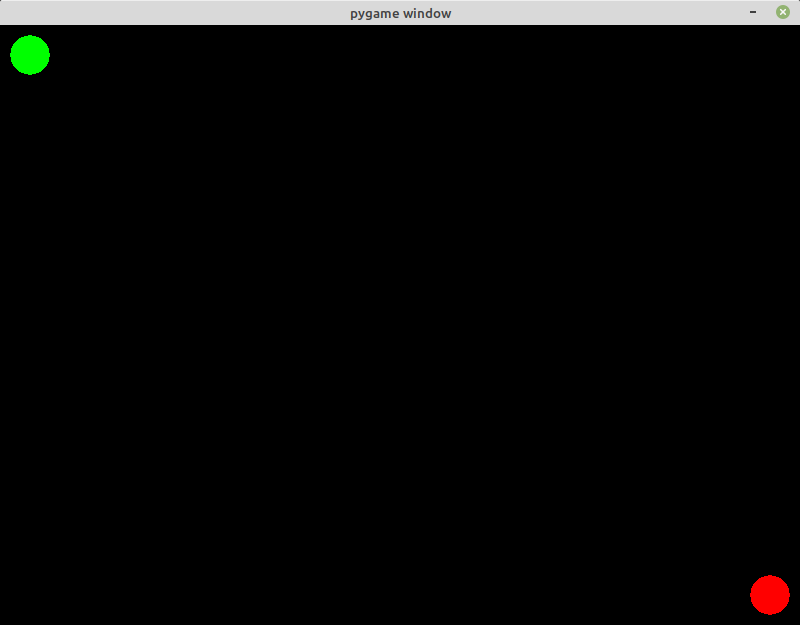

# RRT algorithm implementation using Python and Pygame

This program implements the Rapidly-exploring Random Tree (RRT) algorithm, as described in https://en.wikipedia.org/wiki/Rapidly-exploring_random_tree

Demo video (March 2019): https://www.youtube.com/watch?v=cbYwxA9g_9k

**May 2020 update**: This program was rewritten, and now its code is more organized and better structured.

## How to run

This program was written using [Python](https://www.python.org/) 3.6.8 and [Pygame](https://www.pygame.org/) 1.9.6, but newer versions of Python3 and Pygame must work too.

1. If you don't have Python 3.6 (or newer) and Pygame installed on your system, you must first [download and install Python](https://www.python.org/downloads/) and after that [install the Pygame package](https://www.pygame.org/wiki/GettingStarted).

2. Clone or download this repository to your computer.

3. Open a commands terminal in the 'rrt-path-finder' folder.

4. Execute one of the following commands, according to your Python3 executable name:

   `python3 src/main.py`

   `python src/main.py`

   `py src/main.py`

The application must start, and you will see a new window like the one below:

## Usage

The start position is represented as a green circle, and the goal position as a red circle.
Use the mouse to move the start and goal positions.
Use the left mouse button to draw obstacles, and the right button to erase them.

##### Keyboard:

When the algorithm is not running:

- <kbd>Return</kbd>: Start the RRT algorithm on the current map.
- <kbd>c</kbd>: Clear the map's obstacles.
- <kbd>s</kbd>: Save the current map as 'map.png'
- <kbd>l</kbd>: Load an existing 'map.png' file as the new obstacles map.

When the algorithm is running or a path was found:

- <kbd>h</kbd>: Show / hide information about the algorithm on the screen.

  If any key other than <kbd>h</kbd> is pressed now, then the algorithm stops and the program returns to the initial state.